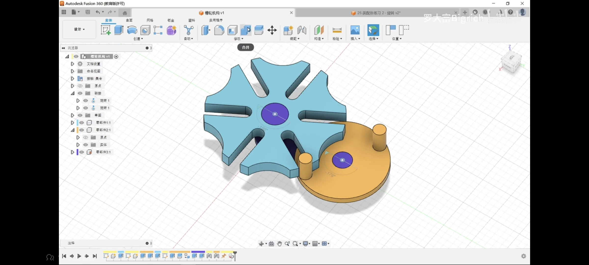
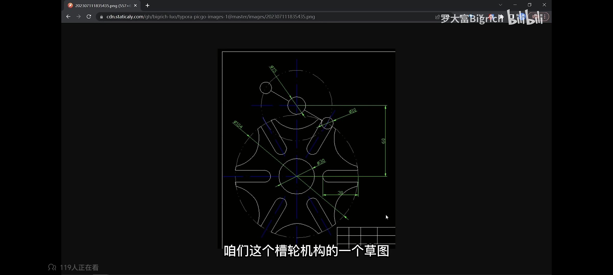
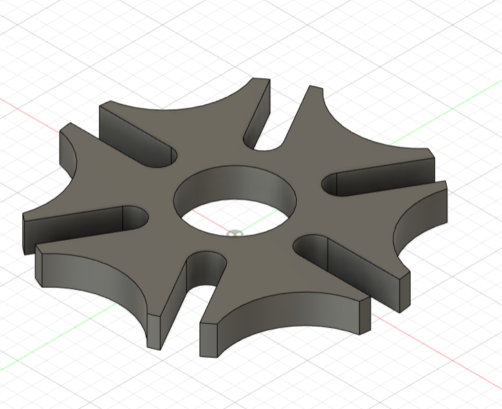
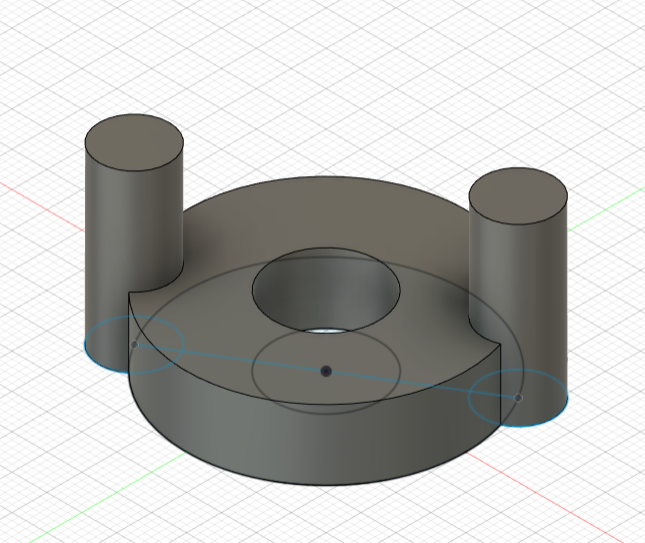
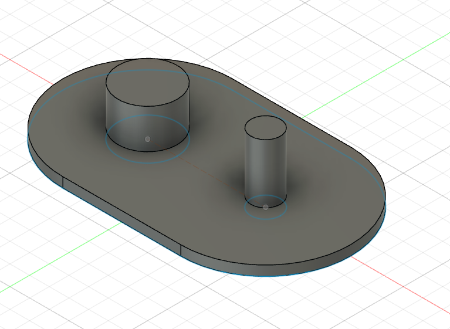

# 学习笔记

> 手册要求把"学习到的知识内容"也以日志形式记录下来，本文就是这部分。
> 结构：每个知识板块一个 H2，标题下面按日期从早到晚追加学习记录。

## 机械

<!-- 追加位置：新条目按「### 日期 标题」+ 学习人/来源/学了什么/易踩的坑/怎么用到我们的车上 的格式往下写 -->

### 2026-09-24 机架的材料与制作

- 学习人：史沐生
- 来源：重庆大学千里战队B站视频
- 学了什么：了解了机架的材料，比如铝合金或者碳板拼插。机架的作用是承载轮组以及搭建机架以上的机器人主体。认识到了铝合金主要分为6系和7系，他们的抗拉强度和屈服强度都有所不同，7系的强度更高但焊接难、成本较高，所以我们主要用6系铝合金。
- 怎么用到我们的车上：学习了机架的材料与制作的有关知识

**当天照片：**

### 2026-09-30 Fusion360安装与草图绘制

- 学习人：喻静琳
- 来源：bilibili2023年最新Fusion360教程
- 学了什么：直线，矩形，圆等基本草图命令的认识，练习绘制完整草图
- 怎么用到我们的车上：成功下载fusion360面向个人的免费版本，完成5个草图练习
- 学习中遇到的问题：创建草图时耗时过长，草图有些点衔接不上，草图不够美观

**当天照片：**

### 2026-10-01 实体命令的认识与练习

- 学习人：喻静琳
- 来源：bilibili2023年最新Fusion360教程
- 学了什么：学习拉伸，旋转命令，完成一个微型带轮的实体练习
- 学习中遇到的问题：第一个思路：画出正视面草图，用拉伸创建实体，再通过旋转剪切出带轮曲面上的凹槽
- 学习中的解决过程：观察到除去中间孔，实体整体对称性较强，考虑用截面旋转得到，再用拉伸剪切去中间孔

**照片：**

### 2026-10-02 其他实体命令的认识与练习

- 学习人：喻静琳
- 来源：bilibili2023年最新Fusion360教程
- 学了什么：扫掠，基准面的构造命令的认识与实体练习
- 学习中遇到的问题：草图没画完就点了完成，再进入该平面时发现无法在原有的草图上做修改。左边的面板上有十几个草图，都没有另外命名，非常混乱。
- 学习中的解决过程：询问Deepseek后找到草图无法再编辑原因，重新创建了一个草图，点击完成草图之前确定了草图已经完全约束

**照片：**

### 2026-10-03 完成剩余实体命令的学习

- 学习人：喻静琳
- 来源：bilibili2023年最新Fusion360教程
- 学了什么：加强筋，孔，放样，抽壳，圆角实体命令的学习，学会创建三维草图

**照片：**

### 2026-10-04 零件与装配体的学习

- 学习人：喻静琳
- 来源：bilibili2023年最新Fusion360教程
- 学了什么：零件的创建方法，装配体各种运动关系的的学习
- 学习中遇到的问题：槽轮练习中，完成装配体构建后，装配体不能按预想中的运动
- 学习中的解决过程：先检查草图，发现草图缺少一种接触关系，导致接触集合不能很好的发挥作用。重新构建正确的草图后顺利完成装配体练习

**照片：**

### 2026-10-07 快换接口设计与中期考核规则梳理

- 学习人：蔡昌恒
- 来源：《CRTC2026参赛手册》V1.5；团队复核文档
- 学了什么：快换接口的"定位销＋手拧"组合；中期考核"完成度:规则:文档=4:3:3"与12项基础功能的演示要求。
- 重点 / 为什么这样：①立柱改成"上段通用、只换下段"——标定和程序不动，训练用直段、冲分用斜折；②抓取头"一接口多头"——主力夹爪保通用，被动头补断电安全与物资架轴向抽出；③二号车定手动操作——稳定与配合优先，半自动倍率问题列官方答疑。
- 易踩的坑：①托铲头——复核确认方块下面是实心台板，铲不进去，否决；②立柱孔列只做单条→改成左右对称两条＋横撑；③二号车全自动航点——暂缓，降级为可选升级。
- 怎么用到我们的车上：①一号车升级定型：模块化立柱（形态A直段/形态B斜折，拔销换装≤5分钟）＋两侧孔列/加强插孔，分系统3D出齐（整车、立柱、排孔、手臂三档、夹爪、举升）；②抓取头做成"一个快换接口、三种头"——平行夹爪（现役）、弹片内撑＋倒刺、低位耙钩（备用），3D与图纸都出好；③二号车确认回归"PS2手动操作"，同步修正三份正式文档；④采购对账：已购15项逐项核对（¥388.48），出待购清单（必买≈¥166、建议≈¥87）与采购结构表；⑤出《中期考核待完成互证表》50项（对应12项基础功能＋规则测评＋文档评估，含负责人列）。
- 证据：桌面三个文件夹（一号车-最终方案-竖折柱版 / 二号车-最终方案-V3 / 双车复核更新-2026-10-07）
## 电控与硬件

<!-- 追加位置 -->

### 2026-09-29 电控

- 学习人：蔡昌恒
- 来源：哔哩哔哩
- 学了什么：电控导论

**当天照片：**

## 算法与编程

<!-- 追加位置 -->
## 工具与软件

<!-- 追加位置 -->

### 2026-09-25 如何在电脑上搭建agent

- 学习人：蔡昌恒
- 来源：哔哩哔哩
- 学了什么：在笔记本上从零布设环境
- 重点 / 为什么这样：自己对于电脑相关问题知识缺口太大，无法有效完成基本漏洞的检查和修复

**当天照片：**

### 2026-09-28 用github实现数据上传通路的搭建

- 学习人：蔡昌恒
- 来源：个人
- 学了什么：学会用github搭建数据上传通路，以应对文档考核。
- 重点 / 为什么这样：集思广益，在昨晚组会上有提出两辆车是A+B或是A+Aplus的两套思路，抓取方案有设想但是没有办法验证与修正其可行性。所以先用AI就昨天的设想出具了两张草图，给团队以相对清晰的认识，再次基础上再做设计的更迭。
- 怎么用到我们的车上：出版1号与2号车多个版本雏形，将其完善并在小组中征集新的收集思路与放置方式（以word形式发布问卷，收集上来由组长统一处理）
## 规则与赛务

**2026-09-28 手册通读（全队）**

- 学习人：全队
- 来源：《2026 CRTC 参赛手册 V1.4》
- 学了什么：比赛日程、检录硬指标（尺寸/重量/电源/无线继电器）、得分规则（白块 1 分、黄块 4 分，全自动有倍率）、中期考核三部分占比
- 易踩的坑 / 重点：报名 9/30 截止；未通过中期考核不予报销；只能使用一种无线通讯方式
- 怎么用到我们的车上：据此确定两车方案与预算上限，详见 `01`~`06` 各篇

### 2026-10-05 手册更新到 V1.5，看看改了啥

- 学习人：蔡昌恒
- 来源：《2026 CRTC 参赛手册》V1.5（跟 V1.4 一页页比）
- 学了什么：一共改了六处——培训时间定了（10/8–11 晚上）、遥控器条款、开源项目必须在中期考核里写清楚、方块从 40 改回 30、晋级名额新生组从 56 提到 60、中央高地那个十字基座是 300×300、矮墙离中心 64.25
- 学习中遇到的问题：无
- 学习中的解决过程：已经写进文档
- 分类：规则
## 其他

<!-- 追加位置 -->
