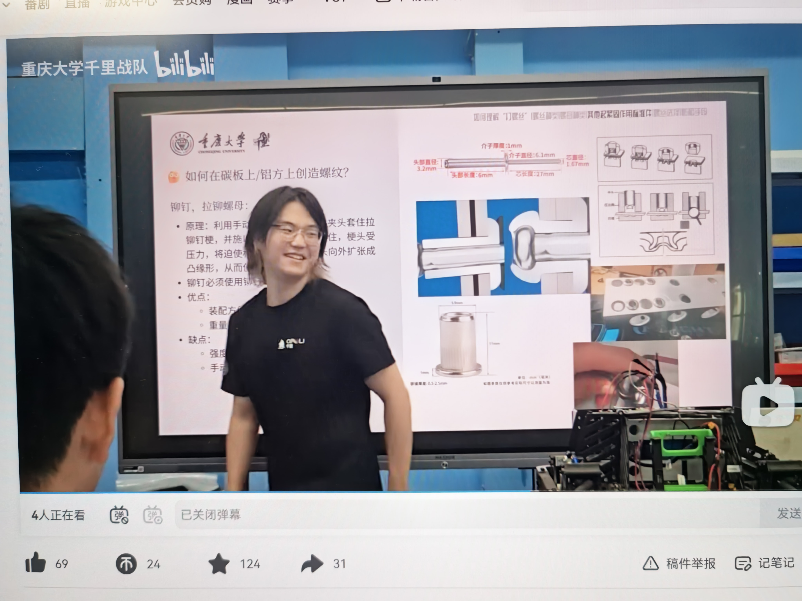
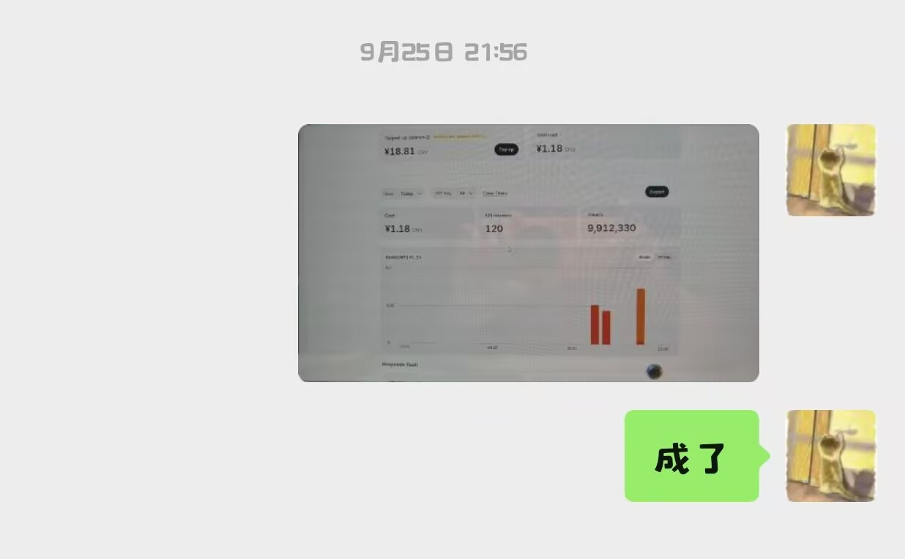

# 学习笔记

> 手册要求把"学习到的知识内容"也以日志形式记录下来，本文就是这部分。
> 结构：每个知识板块一个 H2，标题下面按日期从早到晚追加学习记录。

## 机械

<!-- 追加位置：新条目按「### 日期 标题」+ 学习人/来源/学了什么/易踩的坑/怎么用到我们的车上 的格式往下写 -->

### 2026-09-24 机架的材料与制作

- 学习人：史沐生
- 来源：重庆大学千里战队B站视频
- 学了什么：了解了机架的材料，比如铝合金或者碳板拼插。机架的作用是承载轮组以及搭建机架以上的机器人主体。认识到了铝合金主要分为6系和7系，他们的抗拉强度和屈服强度都有所不同，7系的强度更高但焊接难、成本较高，所以我们主要用6系铝合金。
- 怎么用到我们的车上：学习了机架的材料与制作的有关知识

**当天照片：**

### 2026-09-30 Fusion360安装与草图绘制

- 学习人：喻静琳
- 来源：bilibili2023年最新Fusion360教程
- 学了什么：直线，矩形，圆等基本草图命令的认识，练习绘制完整草图
- 怎么用到我们的车上：成功下载fusion360面向个人的免费版本，完成5个草图练习
- 学习中遇到的问题：创建草图时耗时过长，草图有些点衔接不上，草图不够美观

**当天照片：**

## 电控与硬件

<!-- 追加位置 -->

### 2026-09-29 电控

- 学习人：蔡昌恒
- 来源：哔哩哔哩
- 学了什么：电控导论

**当天照片：**

## 算法与编程

<!-- 追加位置 -->
## 工具与软件

<!-- 追加位置 -->

### 2026-09-25 如何在电脑上搭建agent

- 学习人：蔡昌恒
- 来源：哔哩哔哩
- 学了什么：在笔记本上从零布设环境
- 重点 / 为什么这样：自己对于电脑相关问题知识缺口太大，无法有效完成基本漏洞的检查和修复

**当天照片：**

### 2026-09-28 用github实现数据上传通路的搭建

- 学习人：蔡昌恒
- 来源：个人
- 学了什么：学会用github搭建数据上传通路，以应对文档考核。
- 重点 / 为什么这样：集思广益，在昨晚组会上有提出两辆车是A+B或是A+Aplus的两套思路，抓取方案有设想但是没有办法验证与修正其可行性。所以先用AI就昨天的设想出具了两张草图，给团队以相对清晰的认识，再次基础上再做设计的更迭。
- 怎么用到我们的车上：出版1号与2号车多个版本雏形，将其完善并在小组中征集新的收集思路与放置方式（以word形式发布问卷，收集上来由组长统一处理）
## 规则与赛务

**2026-09-28 手册通读（全队）**

- 学习人：全队
- 来源：《2026 CRTC 参赛手册 V1.4》
- 学了什么：比赛日程、检录硬指标（尺寸/重量/电源/无线继电器）、得分规则（白块 1 分、黄块 4 分，全自动有倍率）、中期考核三部分占比
- 易踩的坑 / 重点：报名 9/30 截止；未通过中期考核不予报销；只能使用一种无线通讯方式
- 怎么用到我们的车上：据此确定两车方案与预算上限，详见 `01`~`06` 各篇
## 其他

<!-- 追加位置 -->
