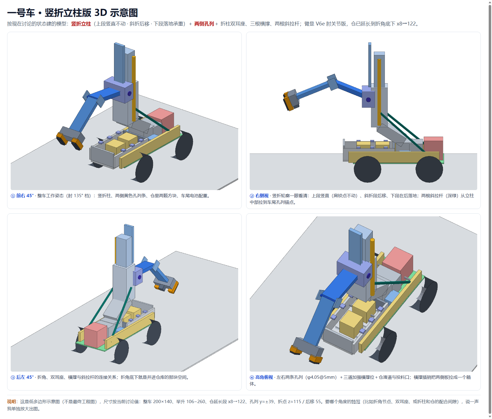
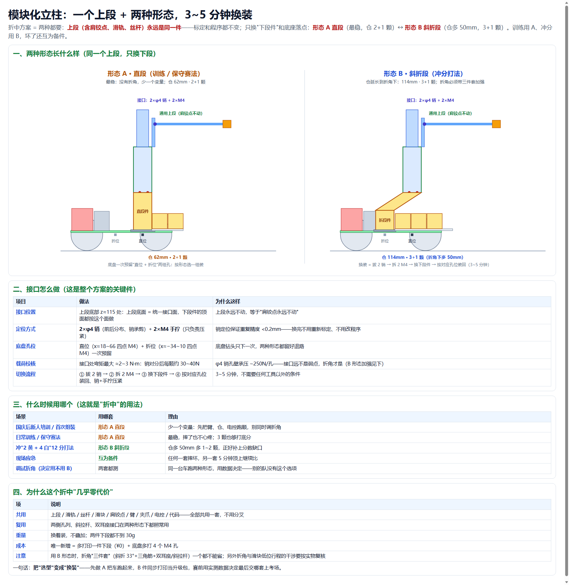
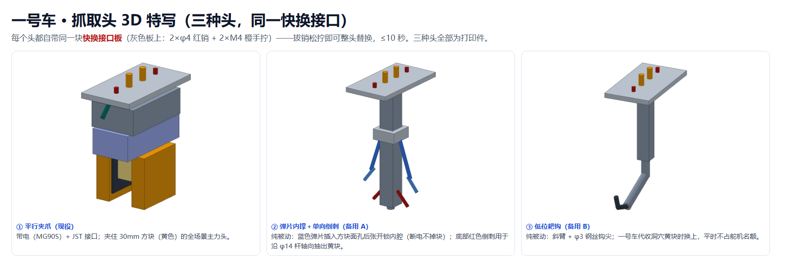
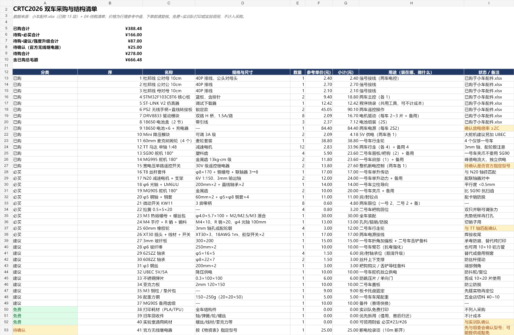
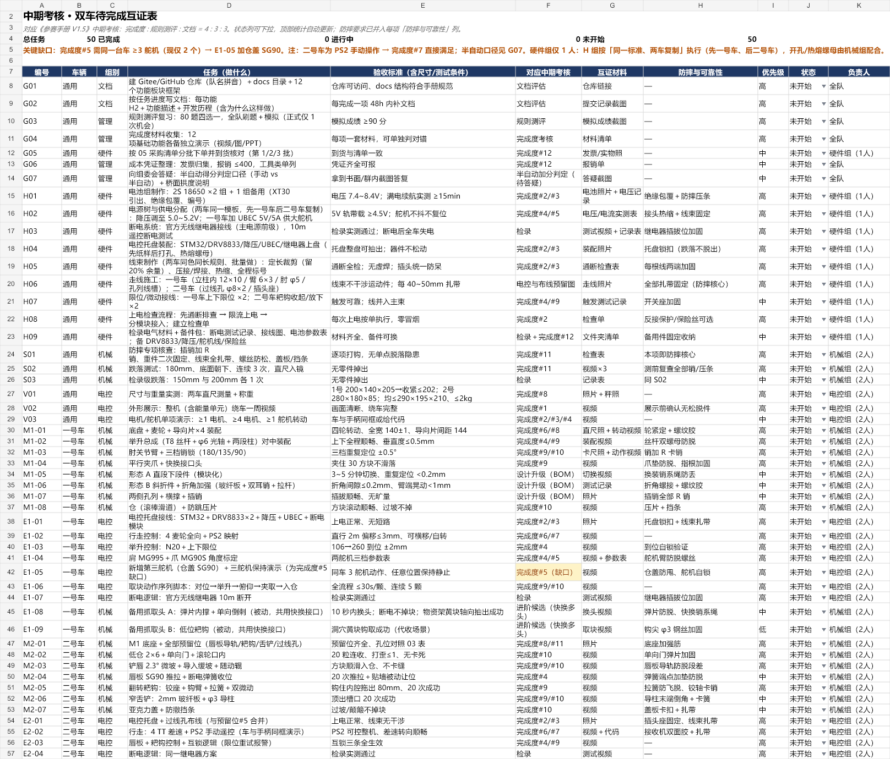
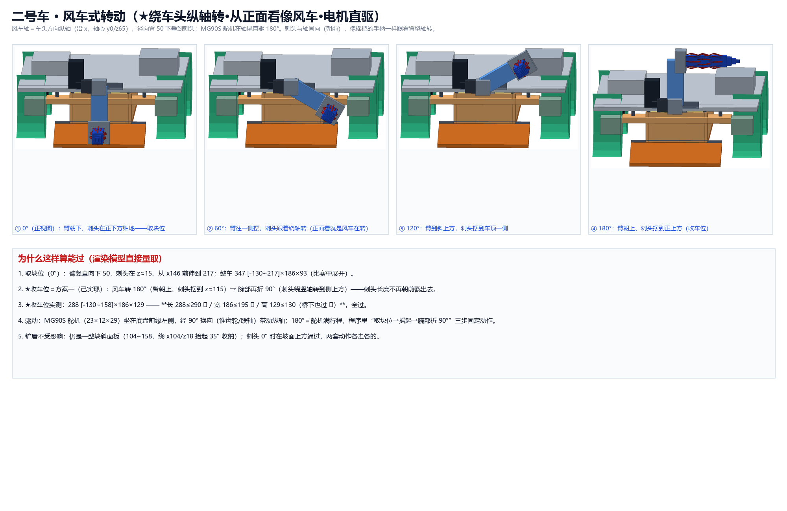
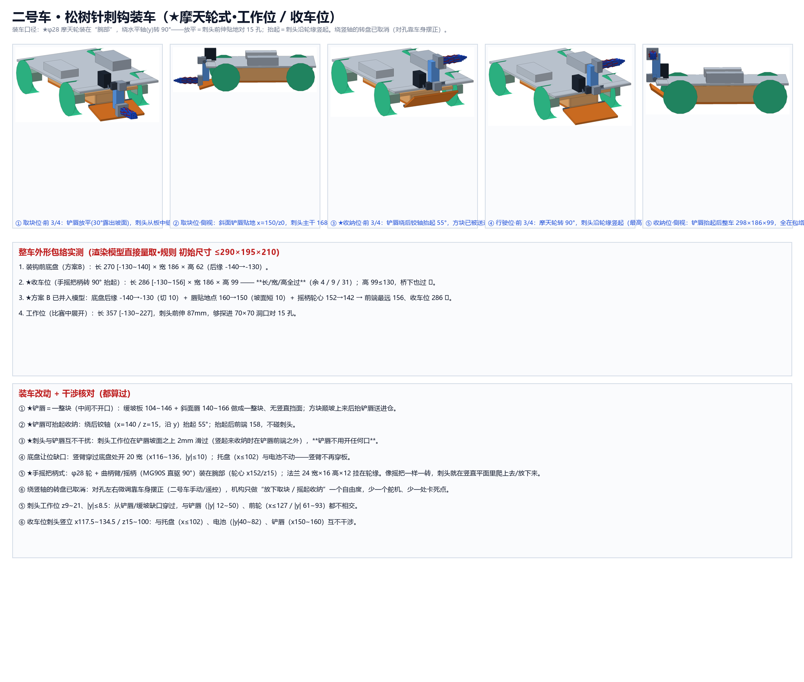
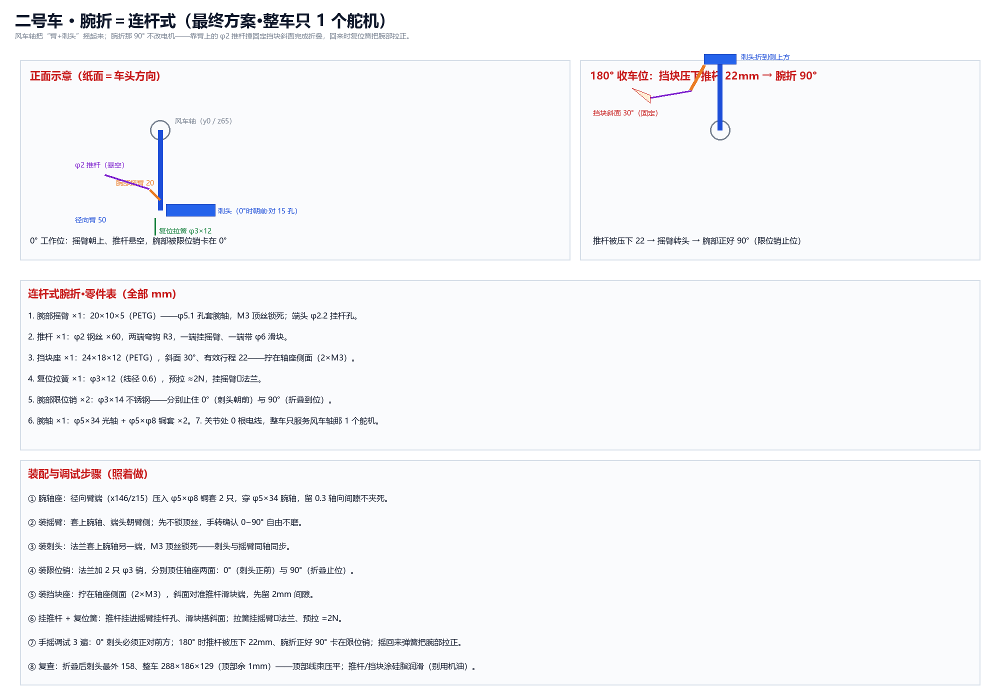
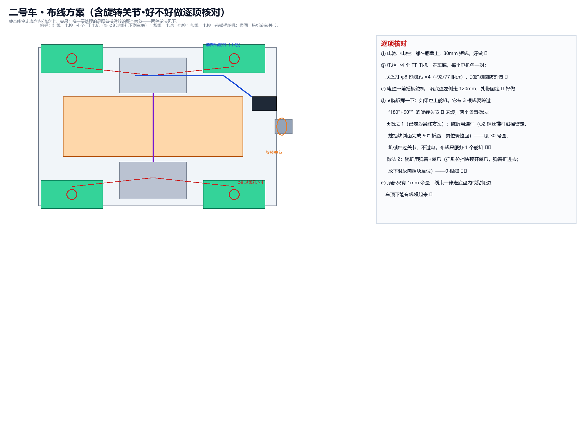
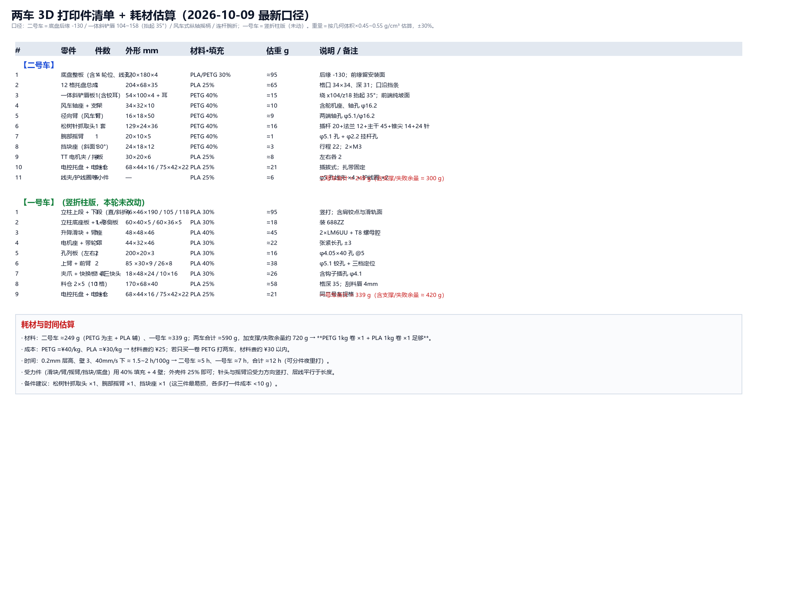

# 蔡昌恒 · 队长 + 电控 · 进度页（队内）

- 角色：队长（报名、赛务、统筹、文档统管）+ 1 号车电控
- 负责模块：报名与赛务、总进度看板同步、1 号车电控（主控/驱动/PS2/舵机/麦轮运动学）
- 本周时间投入：约 __ 小时

## 进度记录（按时间从早到晚）

### 2026-09-25 日报

- 今日工时：2
- 关键决定（为什么这样做）：自己对于电脑相关问题知识缺口太大，无法有效完成基本漏洞的检查和修复
- 学习内容：在笔记本上从零布设环境
- 学习来源：哔哩哔哩

**当天照片：**

### 2026-09-28 立项与文档体系

- 做了什么：读完 V1.4 手册；确定两车方案；搭好文档与进度体系；录入全队分工（含采买/财务分离）
- 关键结论：报名已提交（新生组）；中期考核 10/19 24:00；1 号车 160 mm 车宽过 150 mm 桥面存疑
- 证据：[总进度看板](../00-总进度看板.md)

### 2026-09-28 日报

- 今日工时：3
- 今日目标：根据团队前期会议对车型与抓取方式的可行性进行模拟
- 做了什么：出版1号与2号车多个版本雏形，将其完善并在小组中征集新的收集思路与放置方式（以word形式发布问卷，收集上来由组长统一处理）
- 关键决定（为什么这样做）：集思广益，在昨晚组会上有提出两辆车是A+B或是A+Aplus的两套思路，抓取方案有设想但是没有办法验证与修正其可行性。所以先用AI就昨天的设想出具了两张草图，给团队以相对清晰的认识，再次基础上再做设计的更迭。
- 遇到的问题：没有办法把想法可视化，目前方案做比较脱离实践，可能出现不必要的损失浪费。
- 怎么解决的：使用AI完成先行方案评估与草图绘制
- 采购 / 花费：一些token
- 完成度自评：尚可
- 学习内容：学会用github搭建数据上传通路，以应对文档考核。
- 学习来源：个人
- 明日计划：继续完善该通路，并对前期学习内容进行存档完善

**当天照片：**

### 2026-09-29 日报

- 今日目标：了解电控基本知识
- 学习内容：电控导论
- 学习来源：哔哩哔哩

**当天照片：**

### 2026-10-04 日报

- 今日工时：3.5
- 今日目标：把一号车的设计定稿成一套图：部件详图、高度链复核、下探底架与打印件
- 做了什么：进行一些一号车的版本更新
- 关键决定（为什么这样做）：原有方案不够完备，现有方案需要结合具体尺寸与组员建议进行新版本更迭
- 实操中遇到的问题：需要利用AI喂出一个相对合理的设计草图，但是很多时候生成的图片与我们的想法有误差，需要不断修正。同时，方案也在图片给出的同时暴露了更多问题，在投喂时也让人发现更多的潜在问题，辅助AI进行修正，确保在大方向上设计没有太大问题。
- 实操中怎么解决的：现在能做的就是投入时间成本与主观力学直觉，修正一些AI的问题，同时人工复核尺寸，确保其可以使用符合要求。
- 设计思路更新：改前：三档高度表 + 转塔 φ46 + 丝杆 160 + 背部 8 格竖排料仓 + 前开口低仓；改后（V2）：取块头轴线绝对高度体系 + 转塔 φ32 + 丝杆 170 + 2×5 十格托盘（格口朝上）+ 回缩臂 + 刮料唇，立柱底座改为轮间下探底架（离地 10 → 柱顶 200）。

**当天照片：**

### 2026-10-05 日报

- 今日工时：6
- 今日目标：今天基本就磨二号车一件事：把它的结构问题一条条挑出来、改到能落地的版本（最后定成 V3），顺便把跟手册 V1.5 有关的规矩也更新掉。
- 做了什么：二号车从“甲方案”改到了 V3 定稿：车顶那个托盘整个取消，改成四个轮子中间的低仓，方块不用再往上抬；铲子那一块大改（能收、能滚上去）；耙钩和舌铲重新分道；最后把全套图都出齐了——整车渲染、M1→M4 分阶段升级、预留位特写、四种取块流程分镜，都整理进“二号车-最终方案-V3”文件夹。另外按手册 V1.5 更新了文档，还拿一份独立复核报告逐条对了一遍账。
- 关键决定（为什么这样做）：今天方案里的几个关键改动：① 拨轮原来压在铲子正上方，方块进来会被挡住，所以我把它改成小号软压轮、挪进口子里面（X≈−13），前面一段全让空；② 翻转耙钩和窄舌铲摆在同一侧，很容易打架，所以我把它们分开走：耙钩放正中间、舌铲挪到右边；③ 铲子太长会挡住洞口和矮墙，所以我给铲板加了“让位”——一开始想的是被墙顶回去的被动式，后来一算检录要求初始长度 ≤290，就改成 SG90 主动推拉、平时全收进去；④ 为了能让方块顺顺当当上去、最好还能再抬一点，我把原来 45° 的短坡换成 13° 的长缓坡加一根 φ6 小滚轮，方块是“滚”上去的，不是硬顶；另外多留了一个“铲唇抬头”的方案 C 备用；⑤ 为了先把二号车定下来、把预留位都留好，我把中央、左道、右道三组一样的安装位都留了出来，方案 C 的铰链位、舵机位也一起留，并全部拍了特写。
- 试过但放弃的做法：① 车顶托盘 + 垂直提升：多一套机构、多两个卡块的地方，放弃；② 纯靠弹簧回缩的铲板：静止时铲板是伸出来的，整车快到 380，检录就过不了，放弃；③ 45° 短坡：方块容易被“顶住”，放弃；④ 两车的采购分账先不分，等二号车完全定稿再统一算。
- 实操中遇到的问题：① 二号车铲板装上一量，长度会超过 290 的线；② 复核发现 e3 物资架那颗黄块根本钩不进去（杆 φ14、方块内孔 15，缝只有 0.5mm）；③ “半自动能拿 32.5 分”这个说法不能当真；④ 复核报告里“车长至少 324”和我们模型对不上，得澄清。
- 实操中怎么解决的：① 铲板改成舵机推拉、初始全收，全长 280–285，能过检录；② e3 那颗黄块改成从外面钩住往外拽（备选小夹爪），先列进验证清单做 20 次；③ 对外统一说“27 分是保底，32.5 等官方答疑”；④ 按实际三维模型重新量，确认车身 280 本身没问题，超的是铲板前伸。
- 采购 / 花费：二号车这一辆：官方物资表里分给它的部分大约 145 元，外面还要买的大概 100–150 元（60mm 橡胶轮、拉簧、微动开关、钢棒铜套、M3 热熔铜螺母、TPU 这些），合计大约 250–300 元。
- 对应考核指标：指标 8 尺寸规范；指标 11 结构稳定性；指标 12 规划 / 采购
- 完成度自评：🟡 进行中（方案和图纸定稿，等打印件验证）
- 队务与事务：把手册 V1.5 的变更写进了文档，新加了两篇（开源项目说明、独立复核对账）；实训分组也定了：千里战队。
- 设计思路更新：V2 是“铲板被动回缩 + 45° 短坡”；V3 改成“铲板舵机推拉（平时全收）+ 13° 缓坡 + φ6 随动辊”，另外把方案 C（铲唇抬头）的铰链位和舵机位先留出来。
- 明日计划：出二号车 M1 的打印清单去下单；做几个纸板验证件（70×70×50 的洞、1:0.5 的坡、150 宽的桥）；电控组把开源说明里的版本号和许可证补上。
- 需要的支持：帮我确认一下二号车的路线：是北上 e8 顺路多拿 3 分，还是只跑 d1；还有 e3 那颗黄块到底用“外面钩”还是“小夹爪”。

**当天照片：**

### 2026-10-07 日报

- 今日工时：6
- 今日目标：把一号车的新升级（模块化立柱＋多头快换）定稿，并完成两车复核、采购对账和中期考核清单。
- 做了什么：①一号车升级定型：模块化立柱（形态A直段/形态B斜折，拔销换装≤5分钟）＋两侧孔列/加强插孔，分系统3D出齐（整车、立柱、排孔、手臂三档、夹爪、举升）；②抓取头做成"一个快换接口、三种头"——平行夹爪（现役）、弹片内撑＋倒刺、低位耙钩（备用），3D与图纸都出好；③二号车确认回归"PS2手动操作"，同步修正三份正式文档；④采购对账：已购15项逐项核对（¥388.48），出待购清单（必买≈¥166、建议≈¥87）与采购结构表；⑤出《中期考核待完成互证表》50项（对应12项基础功能＋规则测评＋文档评估，含负责人列）。
- 关键决定（为什么这样做）：①立柱改成"上段通用、只换下段"——标定和程序不动，训练用直段、冲分用斜折；②抓取头"一接口多头"——主力夹爪保通用，被动头补断电安全与物资架轴向抽出；③二号车定手动操作——稳定与配合优先，半自动倍率问题列官方答疑。
- 试过但放弃的做法：①托铲头——复核确认方块下面是实心台板，铲不进去，否决；②立柱孔列只做单条→改成左右对称两条＋横撑；③二号车全自动航点——暂缓，降级为可选升级。
- 实操中遇到的问题：①文档与图纸里有旧口径残留（二号车写成"全自动"、TT×2、旧金额）；②采购表和结算单差了1分钱；③一号车过桥余量只有5mm。
- 实操中怎么解决的：①全库检索、逐处修正（含三份正式文档）；②按实际单价摊平，已购合计对到¥388.48；③过桥列为训练第一优先，并把初始高度收紧到≤202。
- 采购 / 花费：已购¥388.48（15项）核对无误；待购：必买≈¥166、建议/强度升级≈¥87、待确认（无线继电器）¥25；3D打印由实训队免费。
- 对应考核指标：指标 8 尺寸规范；指标 9 方块携带（单一）；指标 10 方块携带（多项）；指标 11 结构稳定性；指标 12 规划 / 采购
- 完成度自评：🟡 进行中（设计与清单定稿，等打印件到手验证）
- 学习内容：快换接口的"定位销＋手拧"组合；中期考核"完成度:规则:文档=4:3:3"与12项基础功能的演示要求。
- 学习来源：《CRTC2026参赛手册》V1.5；团队复核文档
- 队务与事务：完成采购对账（¥388.48）并出待购清单；把"半自动判定"列入官方答疑项。
- 设计思路更新：从"一根直柱＋单一夹爪"改为"上段共用、下段可换（直段/斜折），抓取头统一快换接口（夹爪/弹片/耙钩）"。
- 明日计划：按《中期考核互证表》推进——机械打二号车M1底座与一号车形态A件；电控先跑"行走＋举升"框架；硬件做电池组与电源树。
- 需要的支持：确认官方无线继电器型号（检录会测断电）；跟进半自动得分判定的官方答复。
- 证据：`桌面三个文件夹（一号车-最终方案-竖折柱版 / 二号车-最终方案-V3 / 双车复核更新-2026-10-07）`

**当天照片：**

### 2026-10-09 日报

- 今日工时：7
- 今日目标：把二号车的洞穴取块头（刺钩）从"转盘式"改成能落地、又能过检录尺寸的"风车摇柄式"，并把整车图、布线、腕折、零件清单一次收口。
- 做了什么：① 刺钩改成"开放版"——3 圈 × 8 根共 24 根独立细针（φ1.6、最长 15、外径 17），一根根分开、不再连成片；② 摇柄从"绕竖轴转"改成"绕车头纵轴转"，从正面看像风车，MG90S 舵机直驱 180°；③ 摇到 180° 后腕部再折 90°，用连杆完成（φ2 推杆 + 30° 斜面挡块 + 复位簧 + 两只 φ3 限位销），旋转关节处 0 根电线；④ 铲唇改成一整块斜面板（104~158，绕 x104/z18 抬起 35°），中间不开任何口；⑤ 底盘后缘 -140→-130；⑥ 出图 24~31 共 8 张，同时把图册 116 张 3D 源图全量重渲染、所有图纸脚本重跑一遍；⑦ 出打印件清单与耗材估算。
- 关键决定（为什么这样做）：① 转盘（绕竖轴）取消——对孔靠车身摆正，机构只保留"放下取块 / 摇起收纳"一个自由度，少一个舵机、少一处卡死点；② 收车位用"摇起 180° + 腕折 90°"，不用"侧摆 45°"（侧摆会让整车 347 超 290）；③ 腕折用连杆不用第二个舵机（旋转关节 0 根线，装配也简单）；④ 铲唇坚持一整块（刺头在坡面上方 ≥5mm 通过，不需要开缺口）。
- 试过但放弃的做法：① 转盘绕竖轴侧摆 45° 让位 → 整车 347 ✗ 超长；② 刺头绕横轴（侧面看像摩天轮）直接摇到车顶 → 高 165 ✗ 过不了 130 的桥；③ 腕折再加一个舵机 → 3 根线要跨 180°+90° 旋转关节，装配难、易磨断；④ 铲唇中间开 24 让位缝 → 按你要求改成一整块。
- 实操中遇到的问题：① 刺头竖起来会插进坡板；② 收车位超长 16mm；③ 摇柄轮 φ44 凸到 x172 也超长；④ 顶部只剩 1mm 余量。
- 实操中怎么解决的：① 坡板改成一整块斜面、刺头从坡面上方通过；② 按"方案 B"收（后缘 -130 + 唇贴地点 160→150 + 摇柄轴心 152→142）；③ 摇柄轮缩到 φ26 并把轴心移到 x142；④ 线束全部走底盘内/贴侧边，车顶不允许翘线（写进图与流程）。 关键实测（渲染模型直接量取）：收车位 288×186×129 ✓（≤290×195×210，高 129≤130 桥下也过）；取块位展开 347×186×93；刺头过 15 孔：外径 17 → 每侧压回 1.0mm、0.49N/根、应力 22MPa < PETG 屈服 50MPa（安全 2.3 倍）。
- 采购 / 花费：新增只 6 样——φ2 钢丝 ×1、φ3×12 拉簧 ×1、φ3 限位销 ×2、φ5×34 光轴 + φ5×φ8 铜套 ×2 套、MG90S ×1；合计约 25~45 元。两车打印耗材合计约 590g（留余量 720g，PETG 1kg + PLA 1kg 够用，材料费 ≈25 元）。
- 对应考核指标：指标 8 尺寸规范；指标 11 结构稳定性；指标 12 规划 / 采购
- 完成度自评：🟡 进行中（机构与图纸定稿，等打印件与手摇连杆实测）
- 设计思路更新：改前＝转盘绕竖轴旋转 + 竖直臂 + 刺头 90° 折叠 + 铲唇开 24 让位缝；改后＝绕车头纵轴的风车摇柄（MG90S 直驱 180°）+ 连杆腕折 90° + 一体斜铲唇（抬起 35°）。

**当天照片：**

