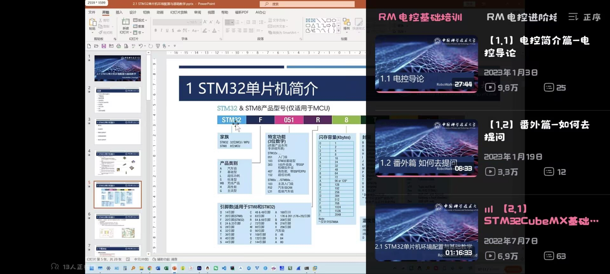

# 蔡昌恒 · 队长 + 电控 · 进度页（队内）

- 角色：队长（报名、赛务、统筹、文档统管）+ 1 号车电控
- 负责模块：报名与赛务、总进度看板同步、1 号车电控（主控/驱动/PS2/舵机/麦轮运动学）
- 本周时间投入：约 __ 小时

## 进度记录（按时间从早到晚）

### 2026-09-25 日报

- 今日工时：2
- 关键决定（为什么这样做）：自己对于电脑相关问题知识缺口太大，无法有效完成基本漏洞的检查和修复
- 学习内容：在笔记本上从零布设环境
- 学习来源：哔哩哔哩

**当天照片：**

### 2026-09-28 立项与文档体系

- 做了什么：读完 V1.4 手册；确定两车方案；搭好文档与进度体系；录入全队分工（含采买/财务分离）
- 关键结论：报名已提交（新生组）；中期考核 10/19 24:00；1 号车 160 mm 车宽过 150 mm 桥面存疑
- 证据：[总进度看板](../00-总进度看板.md)

### 2026-09-28 日报

- 今日工时：3
- 今日目标：根据团队前期会议对车型与抓取方式的可行性进行模拟
- 做了什么：出版1号与2号车多个版本雏形，将其完善并在小组中征集新的收集思路与放置方式（以word形式发布问卷，收集上来由组长统一处理）
- 关键决定（为什么这样做）：集思广益，在昨晚组会上有提出两辆车是A+B或是A+Aplus的两套思路，抓取方案有设想但是没有办法验证与修正其可行性。所以先用AI就昨天的设想出具了两张草图，给团队以相对清晰的认识，再次基础上再做设计的更迭。
- 遇到的问题：没有办法把想法可视化，目前方案做比较脱离实践，可能出现不必要的损失浪费。
- 怎么解决的：使用AI完成先行方案评估与草图绘制
- 采购 / 花费：一些token
- 完成度自评：尚可
- 学习内容：学会用github搭建数据上传通路，以应对文档考核。
- 学习来源：个人
- 明日计划：继续完善该通路，并对前期学习内容进行存档完善

**当天照片：**

### 2026-09-29 日报

- 今日目标：了解电控基本知识
- 学习内容：电控导论
- 学习来源：哔哩哔哩

**当天照片：**

### 2026-10-04 日报

- 今日工时：3.5
- 今日目标：把一号车的设计定稿成一套图：部件详图、高度链复核、下探底架与打印件
- 做了什么：进行一些一号车的版本更新
- 关键决定（为什么这样做）：原有方案不够完备，现有方案需要结合具体尺寸与组员建议进行新版本更迭
- 实操中遇到的问题：需要利用AI喂出一个相对合理的设计草图，但是很多时候生成的图片与我们的想法有误差，需要不断修正。同时，方案也在图片给出的同时暴露了更多问题，在投喂时也让人发现更多的潜在问题，辅助AI进行修正，确保在大方向上设计没有太大问题。
- 实操中怎么解决的：现在能做的就是投入时间成本与主观力学直觉，修正一些AI的问题，同时人工复核尺寸，确保其可以使用符合要求。
- 设计思路更新：改前：三档高度表 + 转塔 φ46 + 丝杆 160 + 背部 8 格竖排料仓 + 前开口低仓；改后（V2）：取块头轴线绝对高度体系 + 转塔 φ32 + 丝杆 170 + 2×5 十格托盘（格口朝上）+ 回缩臂 + 刮料唇，立柱底座改为轮间下探底架（离地 10 → 柱顶 200）。

**当天照片：**

### 2026-10-05 日报

- 今日工时：6
- 今日目标：今天基本就磨二号车一件事：把它的结构问题一条条挑出来、改到能落地的版本（最后定成 V3），顺便把跟手册 V1.5 有关的规矩也更新掉。
- 做了什么：二号车从“甲方案”改到了 V3 定稿：车顶那个托盘整个取消，改成四个轮子中间的低仓，方块不用再往上抬；铲子那一块大改（能收、能滚上去）；耙钩和舌铲重新分道；最后把全套图都出齐了——整车渲染、M1→M4 分阶段升级、预留位特写、四种取块流程分镜，都整理进“二号车-最终方案-V3”文件夹。另外按手册 V1.5 更新了文档，还拿一份独立复核报告逐条对了一遍账。
- 关键决定（为什么这样做）：今天方案里的几个关键改动：① 拨轮原来压在铲子正上方，方块进来会被挡住，所以我把它改成小号软压轮、挪进口子里面（X≈−13），前面一段全让空；② 翻转耙钩和窄舌铲摆在同一侧，很容易打架，所以我把它们分开走：耙钩放正中间、舌铲挪到右边；③ 铲子太长会挡住洞口和矮墙，所以我给铲板加了“让位”——一开始想的是被墙顶回去的被动式，后来一算检录要求初始长度 ≤290，就改成 SG90 主动推拉、平时全收进去；④ 为了能让方块顺顺当当上去、最好还能再抬一点，我把原来 45° 的短坡换成 13° 的长缓坡加一根 φ6 小滚轮，方块是“滚”上去的，不是硬顶；另外多留了一个“铲唇抬头”的方案 C 备用；⑤ 为了先把二号车定下来、把预留位都留好，我把中央、左道、右道三组一样的安装位都留了出来，方案 C 的铰链位、舵机位也一起留，并全部拍了特写。
- 试过但放弃的做法：① 车顶托盘 + 垂直提升：多一套机构、多两个卡块的地方，放弃；② 纯靠弹簧回缩的铲板：静止时铲板是伸出来的，整车快到 380，检录就过不了，放弃；③ 45° 短坡：方块容易被“顶住”，放弃；④ 两车的采购分账先不分，等二号车完全定稿再统一算。
- 实操中遇到的问题：① 二号车铲板装上一量，长度会超过 290 的线；② 复核发现 e3 物资架那颗黄块根本钩不进去（杆 φ14、方块内孔 15，缝只有 0.5mm）；③ “半自动能拿 32.5 分”这个说法不能当真；④ 复核报告里“车长至少 324”和我们模型对不上，得澄清。
- 实操中怎么解决的：① 铲板改成舵机推拉、初始全收，全长 280–285，能过检录；② e3 那颗黄块改成从外面钩住往外拽（备选小夹爪），先列进验证清单做 20 次；③ 对外统一说“27 分是保底，32.5 等官方答疑”；④ 按实际三维模型重新量，确认车身 280 本身没问题，超的是铲板前伸。
- 采购 / 花费：二号车这一辆：官方物资表里分给它的部分大约 145 元，外面还要买的大概 100–150 元（60mm 橡胶轮、拉簧、微动开关、钢棒铜套、M3 热熔铜螺母、TPU 这些），合计大约 250–300 元。
- 对应考核指标：指标 8 尺寸规范；指标 11 结构稳定性；指标 12 规划 / 采购
- 完成度自评：🟡 进行中（方案和图纸定稿，等打印件验证）
- 队务与事务：把手册 V1.5 的变更写进了文档，新加了两篇（开源项目说明、独立复核对账）；实训分组也定了：千里战队。
- 设计思路更新：V2 是“铲板被动回缩 + 45° 短坡”；V3 改成“铲板舵机推拉（平时全收）+ 13° 缓坡 + φ6 随动辊”，另外把方案 C（铲唇抬头）的铰链位和舵机位先留出来。
- 明日计划：出二号车 M1 的打印清单去下单；做几个纸板验证件（70×70×50 的洞、1:0.5 的坡、150 宽的桥）；电控组把开源说明里的版本号和许可证补上。
- 需要的支持：帮我确认一下二号车的路线：是北上 e8 顺路多拿 3 分，还是只跑 d1；还有 e3 那颗黄块到底用“外面钩”还是“小夹爪”。

**当天照片：**

