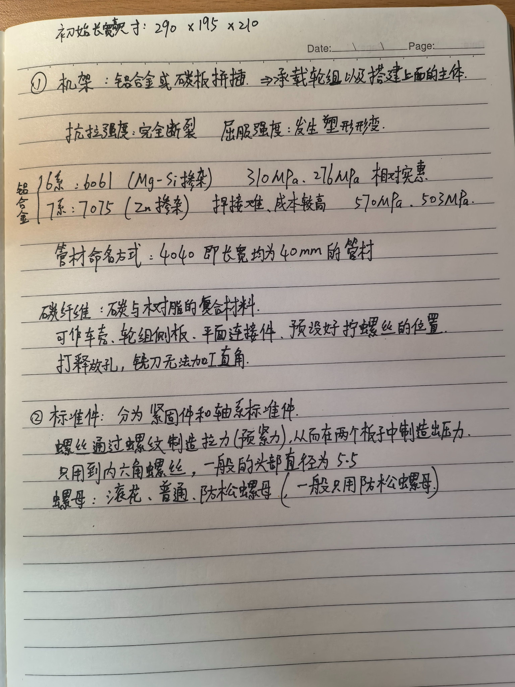

# 史沐生 · 机械（1 号车） · 进度页（队内）

- 角色：机械设计（结构与 3D 建模）
- 负责模块：1 号车整车结构、举升机构、三种取块头、料仓
- 本周时间投入：约 __ 小时

## 进度记录（按时间从早到晚）

### 2026-09-28 现有方案基线

- 1 号车：240×160×200 mm，约 1.1 kg，麦轮 + 举升臂（行程 260 mm）+ 4 格料仓
- 取块头三种：内钩头、矮墙槽顶部内撑爪、低位耙钩（洞穴）
- 待解决：车宽 160 mm vs 桥面 150 mm（负余量）；麦轮 26.6° 坡打滑
- 证据：设计图 `docs/images/`（待补）

### 2026-09-24 日报

- 今日工时：2
- 今日目标：学习机械组的基本知识
- 做了什么：学习了机架的材料与制作的有关知识
- 学习内容：了解了机架的材料，比如铝合金或者碳板拼插。机架的作用是承载轮组以及搭建机架以上的机器人主体。认识到了铝合金主要分为6系和7系，他们的抗拉强度和屈服强度都有所不同，7系的强度更高但焊接难、成本较高，所以我们主要用6系铝合金。
- 学习来源：重庆大学千里战队B站视频
- 明日计划：了解搭建机器人需要用到的各种零部件
- 需要的支持：需要实际的器件操作来支撑理论学习

**当天照片：**

