# 喻静琳 · 机械（2 号车） · 进度页（队内）

- 角色：**机械（2 号车）**——身份不变；另外**兼任采买**（物资比价、下单、到货验收）
- 负责模块：主职——2 号车底盘、铲唇拨轮料仓、结构强度；兼任——全队物资采购
- 本周时间投入：约 __ 小时

## 进度记录（按时间从早到晚）

### 2026-09-28 方案与职责基线

- 2 号车：260×170×180 mm，约 0.9 kg，四轮差速 + 铲唇 + 拨轮 + 单向门 + 10 格料仓
- 关键取舍：整车高 180 mm 钻不过净高 130 mm 的桥下空间；压到 ≤130 mm 可多拿 2 颗白块
- 采买注意：手册写明**未通过中期测评的队伍无需购买无线继电器**；报销上限 400 元且未过中期的队伍不予报销
- 证据：待补

### 2026-09-30 日报

- 今日工时：4
- 今日目标：安装fusion360,掌握fusion中草图的创建
- 做了什么：成功下载fusion360面向个人的免费版本，完成5个草图练习
- 实操中怎么解决的：不急着动手画，先思考怎样画最快最简洁。草图画完后检查是否有数据没有用上，各个部分是否完全约束
- 遇到的问题：创建草图时耗时过长，草图有些点衔接不上，草图不够美观
- 完成度自评：已完成
- 学习内容：直线，矩形，圆等基本草图命令的认识，练习绘制完整草图
- 学习来源：bilibili2023年最新Fusion360教程
- 明日计划：开始实体命令的学习

**当天照片：**

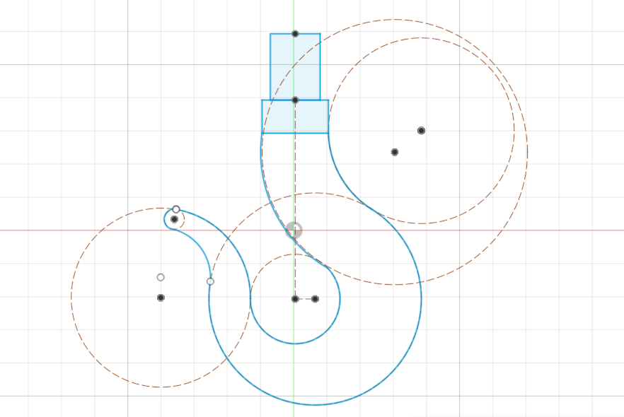
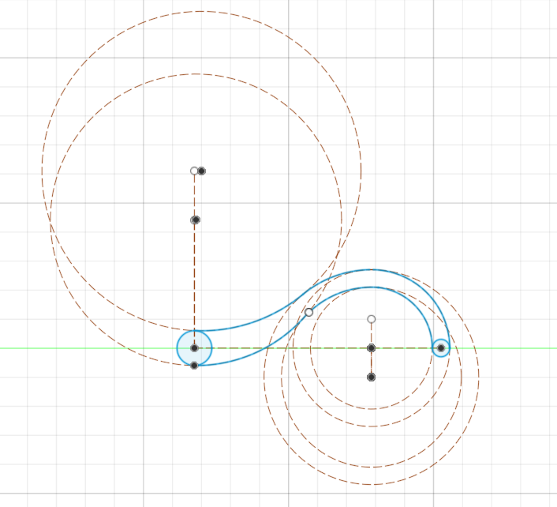
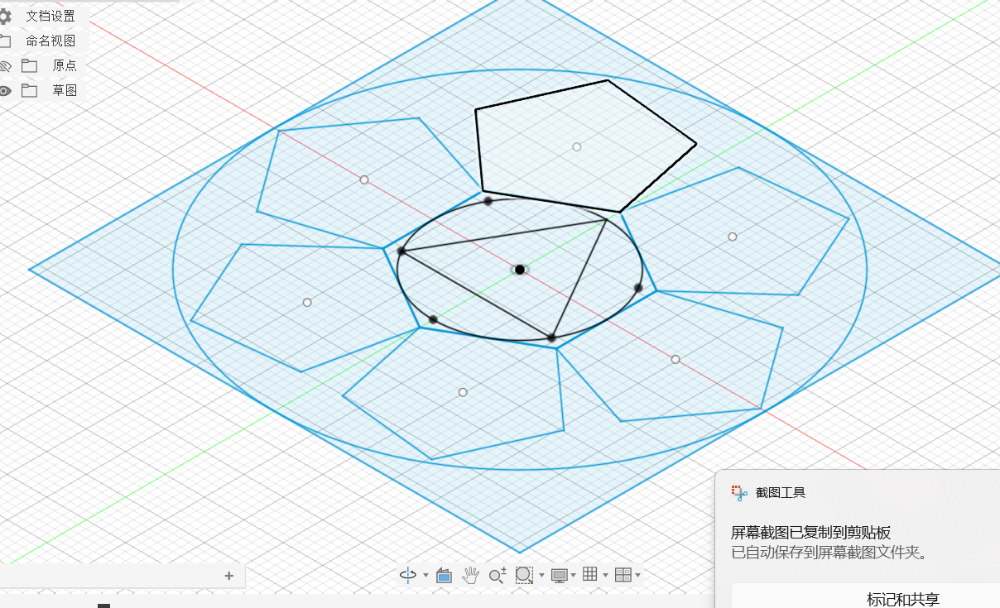
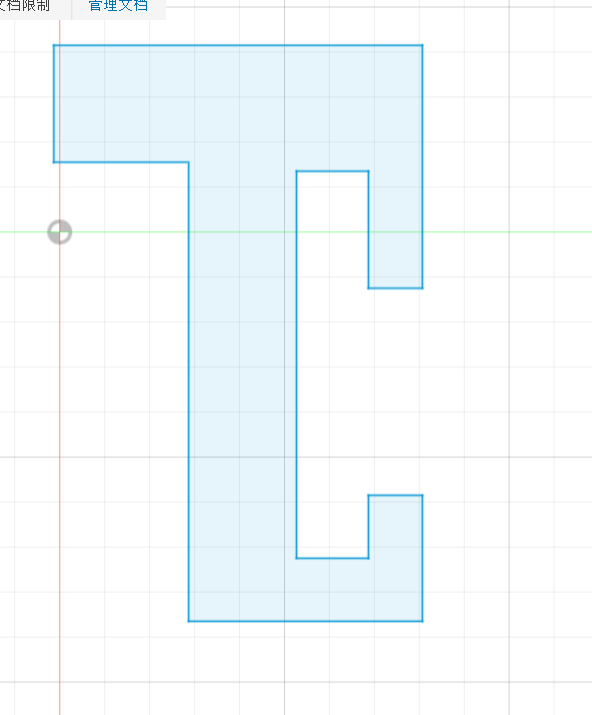

### 2026-10-01 日报

- 今日工时：4
- 今日目标：学习实体命令
- 学习中遇到的问题：第一个思路：画出正视面草图，用拉伸创建实体，再通过旋转剪切出带轮曲面上的凹槽
- 学习中怎么解决的：观察到除去中间孔，实体整体对称性较强，考虑用截面旋转得到，再用拉伸剪切去中间孔
- 遇到的问题：侧视图线段多且短小，保证线段首尾相接且数据准确才能使用旋转命令，操作过于复杂，耗时太长
- 学习内容：学习拉伸，旋转命令，完成一个微型带轮的实体练习
- 学习来源：bilibili2023年最新Fusion360教程
- 队务与事务：采购

**当天照片：**

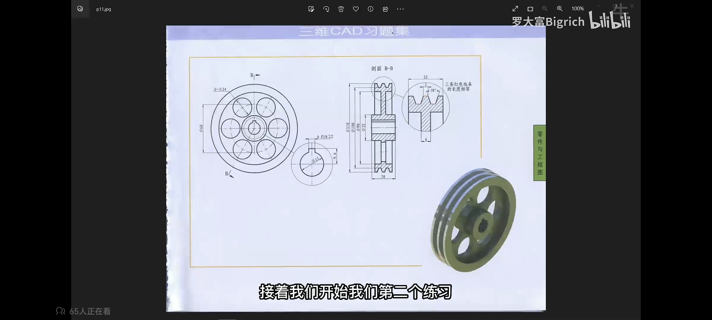
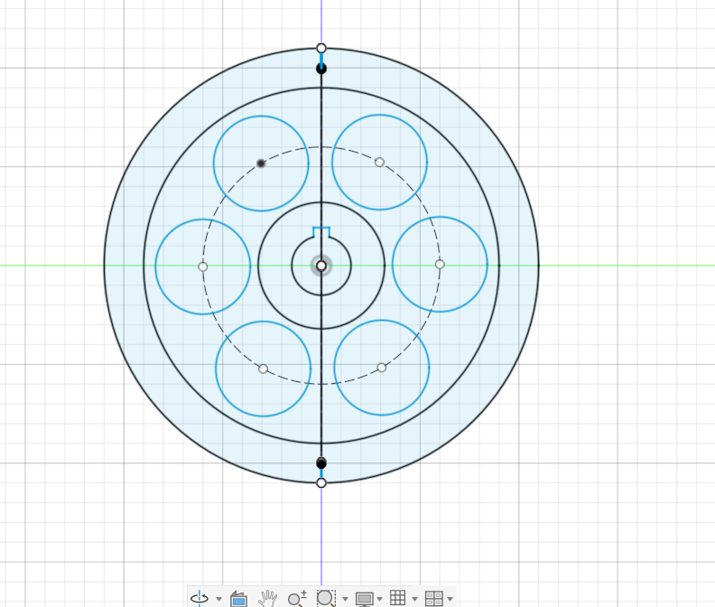
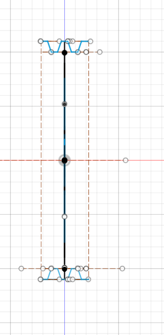
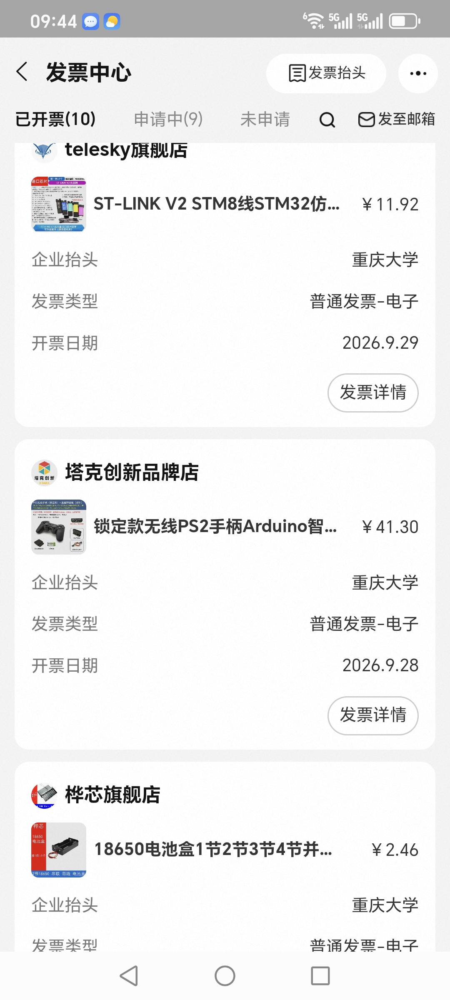

### 2026-10-02 日报

- 今日工时：3.5
- 今日目标：继续实体命令的学习
- 学习中遇到的问题：草图没画完就点了完成，再进入该平面时发现无法在原有的草图上做修改。左边的面板上有十几个草图，都没有另外命名，非常混乱。
- 学习中怎么解决的：询问Deepseek后找到草图无法再编辑原因，重新创建了一个草图，点击完成草图之前确定了草图已经完全约束
- 学习内容：扫掠，基准面的构造命令的认识与实体练习
- 学习来源：bilibili2023年最新Fusion360教程
- 队务与事务：采购

**当天照片：**

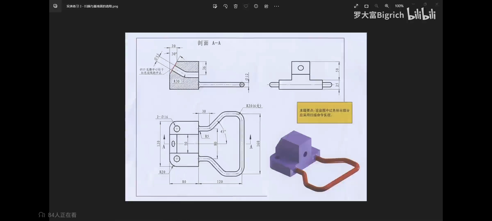
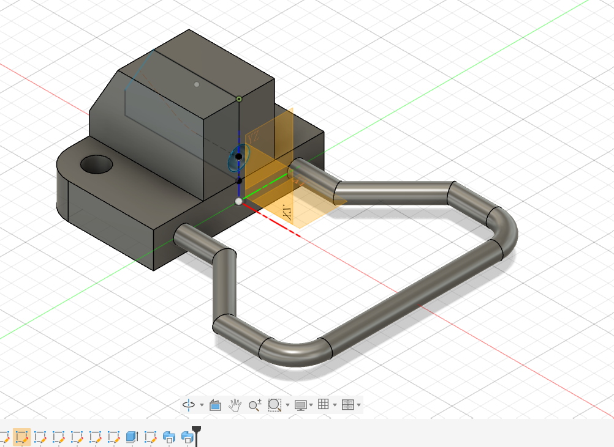
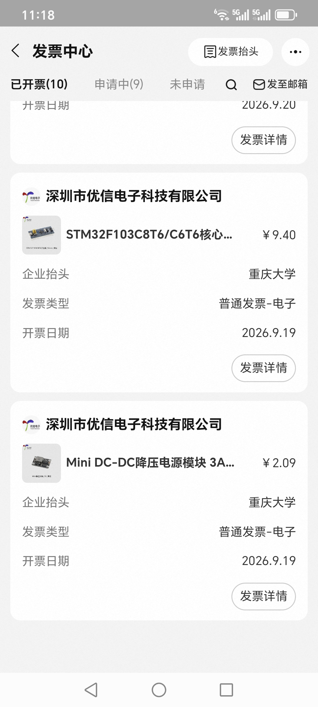

### 2026-10-03 日报

- 今日工时：3
- 今日目标：完成剩余实体命令的学习
- 学习内容：加强筋，孔，放样，抽壳，圆角实体命令的学习，学会创建三维草图
- 学习来源：bilibili2023年最新Fusion360教程

**当天照片：**

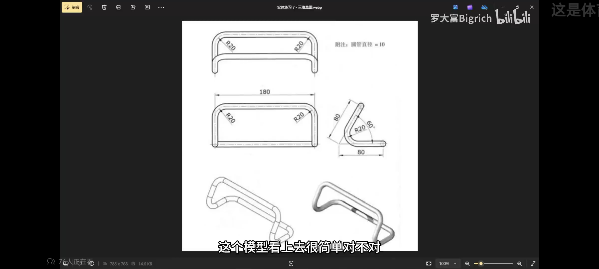

